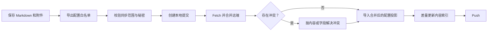

# 跨设备数据同步方案

> 状态：v1 已落地（严格同步白名单、配置投影、字段级合并、拉取后差量处理）
> 适用版本：snippets-code 2.1.61
> 更新日期：2026-09-03
> 范围：GitHub/Git 同步、片段、笔记、附件、用户偏好、新设备恢复与本机数据隔离

## 1. 结论

GitHub 应作为“可移植用户数据的版本化同步通道”，不能作为整台设备应用数据目录的镜像。同步必须使用严格白名单，只包含：

1. 片段与笔记：工作区内带 Frontmatter 的 Markdown 内容。
2. 内容附件：由片段或笔记引用、位于工作区受管目录内的图片和其他附件。
3. 可移植用户配置：自定义快捷键、主题、语言、编辑器显示、通用交互偏好和工作区附件规则。
4. 同步元数据：稳定 vault ID、同步格式版本、最低兼容应用版本和配置 schema 版本。

以下数据不得通过 GitHub 同步：

- 当前设备扫描得到的应用、浏览器书签、桌面文件和其他本机资源。
- 上述资源的用户编辑副本、访问历史、图标、favicon、指纹、扫描快照和索引。
- SQLite 数据库、`cache.json`、全文索引、内存索引快照和任何可重建缓存。
- 工作区绝对路径、插件安装路径、本地模型路径、窗口布局、最近打开位置和运行时标记。
- GitHub Token、Git 凭证、API Key、OAuth Token 和其他秘密。
- 插件包、模型、OCR/FFmpeg/llama 等运行资源。

核心原则是：

> 内容同步，偏好投影；本机资源本机发现，派生数据本机重建；秘密永不进入 Git。

即使某个本机数据恰好在另一台设备也能使用，例如书签 URL，也不改变其来源属性。浏览器书签仍由每台设备自己的浏览器 profile 提供，不进入 Git 同步域。

## 2. 改造基础与本次落地

### 2.1 当前已有基础

- 片段与笔记已经以 `<workspace>/**/*.md` 保存，Frontmatter 中包含稳定 UUID、`type: code|note`、标签和修改时间，适合作为同步事实源。
- 附件已经保存在工作区 `assets/...`，可以与引用它的 Markdown 一起同步。
- Git pull 后已经能按新增、修改、删除的 Markdown 文件差量更新 `cache.json`。
- Git 凭证没有序列化到 `app.json`；`GitSettings.token` 会在加载和保存时清空。
- 远端删除本地 Markdown 前已有风险预检和用户确认。

### 2.2 已解决的主要问题

| 改造前行为 | 问题 | v1 落地结果 |
| --- | --- | --- |
| `git_push` 和手动提交执行 `git add .` | 上传边界依赖 `.gitignore`，新增本机文件时容易误同步 | 已改为枚举 Markdown、受管附件和协议文件并精确暂存 |
| `app.json` 默认被忽略 | 快捷键和通用偏好无法跨设备恢复 | 已生成配置白名单投影，不同步整份 `app.json` |
| `app.json` 混有偏好、路径、Git 配置、运行时状态和 `extra` | 整文件同步会带入无效路径、设备状态和未来未知字段 | 已按字段所有权显式导出和导入，本机字段原样保留 |
| `workspace.json` 同时包含布局和附件设置 | 布局是本机状态，附件规则是工作区配置，生命周期冲突 | `workspace.json` 保持本机；附件规则投影到单文件 `sync.json` |
| pull 后差量列表只处理 `.md` | 同步配置和附件变化无法触发对应导入/刷新 | 已按内容、附件、同步配置分类并分别触发后处理 |
| 默认 `.gitignore` 没有忽略 `workspace.json` | 新设备可能继承另一台设备的 UI 布局 | 已默认忽略 `.snippets-code/*`，仅放行 `sync.json` |
| 旧 `snippets.db` 混合持久状态与本机索引 | 不能安全提交数据库，也不能按数据域恢复 | 首次启动迁移为本机 `core.db`/`search.db`；旧仓库中的数据库会停止跟踪但保留本地文件 |

v1 数据契约的实现入口为 `src-tauri/src/sync_data.rs`，所有应用内 push
入口统一复用该边界；外部终端手工执行的 Git 命令不受应用控制。

## 3. 数据分类与同步矩阵

### 3.1 五类数据

| 分类 | 定义 | GitHub 策略 |
| --- | --- | --- |
| `SYNC_CONTENT` | 用户创建、不可从设备环境重建的内容 | 必须同步 |
| `SYNC_PREFERENCE` | 与设备路径和秘密无关的可移植偏好 | 通过白名单投影同步 |
| `DEVICE_LOCAL` | 只在当前设备或当前 OS 环境有效的数据 | 不同步 |
| `DERIVED` | 可由内容、配置或设备来源重新生成的数据 | 不同步，拉取后重建 |
| `SECRET` | 凭证、令牌、私钥和敏感连接信息 | 禁止写入同步目录 |

默认规则是“未声明即不同步”。新增表、配置字段或插件数据不会因为位于工作区内就自动获得同步资格。

### 3.2 业务数据矩阵

| 数据 | 分类 | 是否同步 | 新设备处理 |
| --- | --- | --- | --- |
| `type: code` 的 Markdown | `SYNC_CONTENT` | 是 | 拉取并建立本机 Markdown 索引 |
| `type: note` 的 Markdown | `SYNC_CONTENT` | 是 | 拉取并建立本机 Markdown 索引 |
| Frontmatter、标签、收藏、分类目录 | `SYNC_CONTENT` | 是 | 以文件和相对路径恢复 |
| 被内容引用的 `assets/...` | `SYNC_CONTENT` | 是 | 校验相对引用和文件 hash |
| vault ID、内容 schema | `SYNC_CONTENT` | 是 | 先做兼容性检查 |
| 快捷键和通用偏好 | `SYNC_PREFERENCE` | 是 | 校验后合并到本机配置 |
| 附件路径模板和命名规则 | `SYNC_PREFERENCE` | 是 | 作为 vault 级设置恢复 |
| 插件期望清单 | `SYNC_PREFERENCE` | 可选 | 只提示安装，不复制插件包 |
| 应用扫描结果 `apps` | `DEVICE_LOCAL` | 否 | 在新设备重新扫描 |
| 浏览器书签 `bookmarks` | `DEVICE_LOCAL` | 否 | 从新设备浏览器 profile 读取 |
| 桌面文件 `desktop_file_cache` | `DEVICE_LOCAL` | 否 | 从新设备配置的目录扫描 |
| 手动添加的本地应用路径 | `DEVICE_LOCAL` | 否 | 保留在创建它的设备 |
| 应用/书签/桌面图标和 favicon | `DERIVED` | 否 | 从新设备 OS 或浏览器本地获取 |
| `cache.json`、`search.db`、倒排索引 | `DERIVED` | 否 | 拉取后差量或全量重建 |
| `core.db`、WAL、SHM | 用户/设备本机状态 | 否 | 只保留在本机，不整库同步 |
| 旧 `snippets.db` | 兼容迁移来源 | 否 | 首次启动迁移后保留为本机回滚参考 |
| 本地资源访问历史 | `DEVICE_LOCAL` | 否 | 新设备从空历史开始 |
| 片段/笔记使用历史 | 用户状态 | v1 不同步 | 后续可设计独立、可合并的内容历史 |
| 窗口布局、选中项、最近打开文件 | `DEVICE_LOCAL` | 否 | 使用新设备默认值 |
| 日志、临时文件、下载缓存 | `DERIVED` | 否 | 不恢复 |
| GitHub Token、API Key、私钥 | `SECRET` | 禁止 | 由系统凭证存储重新授权 |

片段和笔记不需要改为固定的 `snippets/`、`notes/` 目录。当前项目使用 Frontmatter 的 `type` 字段区分二者，并允许用户自定义分类目录；同步应保留这一现有模型。

### 3.3 当前 `AppConfig` 字段归类

不能把 `<data-root>/.snippets-code/app.json` 直接复制到工作区。推荐从当前 `AppConfig` 生成独立同步投影：

| 当前字段 | 策略 | 说明 |
| --- | --- | --- |
| `theme`、`language` | 同步 | 可移植显示偏好 |
| `editor` | 同步 | 行号、行高等编辑偏好 |
| `auto_hide_on_blur` | 同步 | 与路径和硬件无关的交互偏好 |
| `auto_update_check` | 同步 | 通用应用偏好 |
| 各 `*_hotkey` | 同步并校验 | 按动作 ID 合并；冲突时停用该动作而非丢弃配置 |
| `ocr_language` | 同步 | 语言偏好可移植 |
| `translation_engine`、`ocr_engine` | 条件同步 | 目标设备缺少引擎时回退并提示 |
| `dark_mode_config` | 拆字段 | 主题规则可同步，地理位置、系统路径等本机字段不同步 |
| `plugins` | 转成“期望插件” | 不等同于目标设备已安装或已获权限 |
| `auto_start` | 不同步 | 属于设备启动行为和 OS 注册状态 |
| `cache_icons` | 不同步 | 属于设备性能和存储策略 |
| `setup_completed` | 不同步 | 新设备必须完成自己的初始化 |
| `git.*` | 不同步 | 连接、身份、同步频率和最后同步时间均为本机状态 |
| `plugin_install_dir` | 不同步 | 绝对路径不可移植 |
| `workspace_root` | 不同步 | 新设备自行选择工作区位置 |
| `offline_model_activated` | 不同步 | 模型是否安装是设备事实 |
| `update_*`、`setup_*`、`show_progress_*` | 不同步 | 运行时和更新流程标记 |
| `wallpaper_switcher_config` | v1 不同步 | 需先由插件声明可移植字段和秘密字段 |
| `extra` | 禁止整体同步 | 未知字段必须先登记到同步 schema |

`workspace.json` 的同步边界已经拆分：

- `main` 布局在 v1 仍保存在工作区 `.snippets-code/workspace.json`，但被 Git 严格忽略；物理迁到 `<data-root>/state/vaults/<vault-id>` 属于后续存储布局演进。
- `settings.attachment` 已投影到 `sync.json.vaultSettings`，不会整文件同步布局。
- `settings.sync_enabled` 属于本机 Git 插件状态，不进入远端。

## 4. 目标同步目录

继续以现有工作区作为 Git 仓库，不强制迁移用户分类目录：

```text
<workspace>/
├─ <category-a>/*.md
├─ <category-b>/*.md
├─ assets/...                         # 受管附件
├─ .snippets-code/
│  ├─ sync.json                       # 唯一同步配置：ID、版本、偏好、热键和附件规则
│  ├─ app.json                        # 本机/旧文件，忽略
│  ├─ workspace.json                  # 本机布局和 Git 开关，忽略
│  └─ cache.json                      # 派生索引，忽略
├─ .gitignore
└─ .gitattributes                     # 可选：换行和合并规则
```

v1 设备本地实际保存：

```text
<data-root>/
├─ manifest.json                      # 数据布局版本与本机实例 ID
├─ .snippets-code/app.json            # 完整本机配置
├─ core.db                            # 核心状态、搜索历史、插件用户状态（不进入 Git）
├─ search.db                          # 本机派生索引与图标缓存（可删除重建）
├─ snippets.db                        # 旧版本兼容迁移来源；新安装不会主动写入
├─ plugins/<plugin-id>/...            # 可重新安装的插件包
├─ state/
│  ├─ sync/<vault-id>/base/           # 上次成功合并的配置基线
│  ├─ sync/device-id                  # 本机合并身份
│  └─ plugins/<plugin-id>/data.json   # 与插件包隔离的持久数据
└─ ...

<app-cache-dir>/
└─ plugins/<plugin-id>/...            # 壁纸、录屏等设备缓存
```

远端文件是可移植事实的交换格式，本机 `app.json`、`workspace.json`、`core.db` 和 `search.db` 仍是应用运行时读取的存储。它们通过导出器和导入器连接，不能整文件覆盖。`search.db` 可删除重建，`core.db` 不进入 Git 且不得整库覆盖。

## 5. 同步协议

### 5.1 单文件同步协议

`.snippets-code/sync.json` 将 vault 标识、版本信息和四类可移植配置放在一个文件中：

```json
{
  "syncFormatVersion": 2,
  "contentSchemaVersion": 1,
  "preferenceSchemaVersion": 1,
  "vaultId": "uuid",
  "minimumAppVersion": "2.1.43",
  "managedRoots": ["assets"],
  "features": ["content", "preferences", "hotkeys", "vault-settings"],
  "preferences": { "schemaVersion": 1, "values": {}, "tombstones": {} },
  "hotkeys": { "schemaVersion": 1, "values": {}, "tombstones": {} },
  "vaultSettings": { "schemaVersion": 1, "values": {}, "tombstones": {} },
  "desiredPlugins": { "schemaVersion": 1, "values": {}, "tombstones": {} }
}
```

`sync.json` 不记录设备名、绝对路径、用户名或最后同步时间。设备 ID 和同步基线只保存在本机。

### 5.2 配置投影

`sync.json` 中的每个配置分组应具备：

- 独立 `schemaVersion`。
- 仅允许声明过的字段。
- 每个字段的 `updatedAt` 和 `modifiedBy`，用于按字段合并。
- 对“恢复默认值”的显式 tombstone，防止旧设备把已删除配置重新带回。
- 稳定排序和统一换行，降低无意义 Git diff。

实际 v1 文件示例：

```json
{
  "schemaVersion": 1,
  "values": {
    "appearance.theme": {
      "value": "auto",
      "updatedAt": "2026-07-26T08:00:00Z",
      "modifiedBy": "local-device-id"
    },
    "general.language": {
      "value": "zh-CN",
      "updatedAt": "2026-07-26T08:00:00Z",
      "modifiedBy": "local-device-id"
    }
  },
  "tombstones": {}
}
```

`modifiedBy` 可以随字段同步，用于稳定解决时间相同的合并；设备名称、硬件信息和本机路径不得写入。

### 5.3 快捷键表示

快捷键必须以稳定动作 ID 保存，不以页面、插件包路径或 UI 文案作为键：

```json
{
  "schemaVersion": 1,
  "bindings": {
    "search.open": {
      "default": "Ctrl+Space",
      "platform": {
        "macos": "Meta+Space"
      }
    },
    "config.open": {
      "default": "Ctrl+Alt+,"
    }
  }
}
```

导入时执行三类检查：

1. 组合键能否被目标 OS 和 Tauri 全局快捷键支持。
2. 是否与系统保留快捷键冲突。
3. 是否与本应用其他动作冲突。

不兼容时保留远端值，记录为 `inactive` 并提示用户重新绑定；不能静默改成另一组快捷键，也不能让整个配置导入失败。

### 5.4 配置覆盖顺序

应用最终有效配置按以下顺序计算：

```text
产品默认值
  → 已同步的可移植配置
  → 目标设备兼容性修正/本机覆盖
  → 当前会话运行时状态
```

本机覆盖只处理设备差异，例如禁用冲突快捷键、回退缺失 OCR 引擎；用户更改可移植偏好时，应更新同步投影，而不是永久写入一个无法回传的本机副本。

## 6. Git 暂存与防泄漏策略

### 6.1 白名单是主边界

`.gitignore` 只是第二道保护，不能代替同步白名单，因为已经被 Git 跟踪的文件不再受 ignore 规则保护。所有应用发起的提交必须：

1. 由内容管理器列出 Markdown 文件。
2. 由附件管理器列出被引用的受管附件。
3. 由配置导出器生成 `.snippets-code/sync.json`。
4. 仅对上述路径执行 `git add -A -- <paths...>`。
5. 暂存后检查 `git diff --cached --name-only`，发现越界路径立即取消本次同步并报告。

禁止继续以 `git add .` 作为应用同步入口。用户在外部终端自行提交未知文件属于 Git 仓库自身行为，应用在下一次同步前仍应检测并提示远端仓库含有非受管文件。

### 6.2 默认 `.gitignore`

目标工作区规则建议包含：

```gitignore
# Snippets Code 本机状态和派生数据
.snippets-code/*
!.snippets-code/sync.json

*.db
*.db-wal
*.db-shm
*.sqlite
*.sqlite3

# OS、编辑器、缓存和临时文件
.DS_Store
Thumbs.db
desktop.ini
.vscode/
.idea/
*.swp
*.swo
*~
*.bak
*.backup

# 包、模型和可执行资源
node_modules/
dist/
target/
*.exe
*.msi
*.dmg
*.AppImage
```

`assets/` 和 Markdown 不应被忽略。工作区内未知二进制即使没有被 ignore，也不能自动进入应用暂存白名单。

### 6.3 迁移已存在的仓库

升级同步协议时先生成预览，列出：

- 将停止跟踪的 `app.json`、`workspace.json`、`cache.json`、数据库和本机资源文件。
- 将新增的同步投影文件。
- 可能包含秘密或绝对路径的已跟踪文件。
- 超过 GitHub 单文件限制或产品建议上限的附件。

确认后只从 Git 索引移除禁止项，保留本机文件；再提交一次“同步边界迁移”提交。历史提交中已经泄漏的秘密必须立即轮换凭证，并通过独立、明确授权的历史清理流程处理，不能把改 `.gitignore` 当成已经删除历史。

### 6.4 安全检查

每次 push 前至少校验：

- 同步 JSON 不含未登记字段、绝对路径、`file://` 路径和设备用户名目录。
- 不含 token、private key、authorization header、常见 API key 格式。
- 附件实际路径位于工作区内，不跟随 symlink/junction 逃逸。
- 受管文件大小和仓库增长量未超过产品阈值。
- 推荐使用私有 GitHub 仓库；敏感片段由用户明确决定是否进入远端。

## 7. 同步事务

### 7.1 日常同步

推荐把一次同步实现为单一事务：



本地提交先于远端合并，避免未提交的内容被 pull 阻塞或覆盖。任一步失败都保留本地提交和上一个有效配置，不删除用户内容。

同步完成的含义仅是可移植数据已提交并合并，不等待本地应用、浏览器书签或桌面文件扫描完成。

### 7.2 已有设备 pull

pull 后按变化类型分别处理：

| 变化 | 后处理 |
| --- | --- |
| Markdown 新增/修改 | 差量解析 Frontmatter、更新内容索引 |
| Markdown 删除 | 用户确认后删除索引记录和失去引用的附件候选 |
| 附件新增/修改 | 校验 hash，按需刷新正在显示的内容 |
| 附件删除 | 标记引用缺失，不自动删除对应 Markdown |
| `sync.json` | schema 校验后按字段三方合并；应用偏好、热键、附件规则和期望插件 |

pull 不触发应用、书签或桌面文件的远端导入，也不清空这些本机索引。

### 7.3 新设备首次拉取

新设备恢复流程应为：

1. 用户选择新的本机数据目录和空工作区目录。
2. 用户在本机配置 GitHub 仓库、分支和凭证；凭证进入系统凭证存储，不写入仓库。
3. 克隆到临时目录，读取 `sync.json`，校验 vault ID、schema 和最低应用版本。
4. 校验路径、文件大小、Markdown Frontmatter 和附件引用。
5. 原子切换为正式工作区；失败时保留临时目录供诊断，不覆盖现有工作区。
6. 备份目标设备当前可移植配置，导入 `sync.json` 中的偏好和热键。
7. 对快捷键、引擎和期望插件执行兼容性检查，并生成恢复报告。
8. 以拉取到的 Markdown 构建内容索引；首次恢复允许对内容做一次全量索引。
9. 从目标设备独立扫描应用、浏览器书签和桌面目录，结果只写入本机 `search.db` 的来源索引表。
10. 显示“已恢复内容、已应用设置、已跳过本机数据、需处理兼容项”的汇总。

新设备初始化不从远端获得 `setup_completed`、`workspace_root` 或插件安装目录。只有上述步骤完成后，才写入本机初始化状态。

### 7.4 删除传播

| 删除对象 | 是否跨设备传播 | 规则 |
| --- | --- | --- |
| 片段/笔记 | 是 | Git 删除内容文件；远端删除保留当前确认机制 |
| 内容附件 | 是 | 仅在引用计数为零且用户确认后提交删除 |
| 同步偏好 | 是 | 写入字段 tombstone，表示恢复默认值 |
| 本机应用/书签/桌面记录 | 否 | 只更新当前设备索引 |
| 本机图标和缓存 | 否 | 只清理当前设备缓存 |
| 本机访问历史 | 否 | 只影响当前设备排序 |

这样可以避免一台设备卸载应用、切换浏览器 profile 或清理图标时，在其他设备产生无意义删除。

## 8. 冲突与兼容策略

### 8.1 内容冲突

- 不同 Markdown 文件：由 Git 自动合并。
- 同一 Markdown 不同区域：优先 Git 三方合并。
- 同一行或 Frontmatter 同字段：展示本地、远端和共同基线，用户确认。
- 远端删除而本地存在：保持当前高风险删除确认，不静默接受。
- 同一附件路径不同内容：按 hash 判断冲突，不以修改时间直接覆盖。

Frontmatter 的 `id` 是内容身份；文件重命名或移动分类不应生成新的内容 ID。

### 8.2 配置冲突

每台设备在 `<data-root>/state/sync/<vault-id>/base/` 保留上次成功同步的配置基线：

- 本地和远端修改不同字段：自动合并。
- 只有一侧修改某字段：采用修改侧。
- 两侧改成相同值：直接合并。
- 两侧并发修改同一字段：比较字段时钟得到确定结果，同时在恢复报告显示覆盖记录。
- 字段时钟相同但值不同：以 `modifiedBy` 稳定排序，并标记需要用户复核。

不能依靠整个 JSON 文件的“最后修改时间”覆盖，因为这样会丢失另一台设备修改的无关设置。

### 8.3 Schema 兼容

- 目标应用低于 `minimumAppVersion`：停止导入，允许用户只读查看恢复清单。
- 已知旧 schema：先迁移同步文件，再导入。
- 新 schema 中的未知字段：保留在 Git 文件中但不写入本机 `app.json`，并提示需要升级。
- 单个无效偏好：隔离该字段，其他字段继续导入。
- 无效 Markdown 或附件：隔离到恢复报告，不因此回滚所有有效内容。

### 8.4 插件兼容

v1 只同步插件的期望状态，不同步包和运行时资源：

- 目标设备缺少插件：列入“待安装”，不自动启用。
- 插件不支持目标平台或版本：保留期望状态并标记不兼容。
- 权限需要重新审批：必须在目标设备再次确认。
- 插件设置只有在 manifest 声明 `portableConfigKeys`、`secretConfigKeys` 和 schema 后才能进入同步投影。
- 本地模型路径、下载资源、缓存和插件数据库默认不具备可移植资格。

## 9. 对现有代码的改造点

| 位置 | 当前行为 | 建议改造 |
| --- | --- | --- |
| `src-tauri/src/git_sync.rs::git_push` | `git add .` | 调用同步范围生成器并精确暂存 |
| `commit_changes_command` | 同样执行 `git add .` | 与 push 共用同一个策略，禁止旁路 |
| `DEFAULT_GITIGNORE` | 忽略 `app.json`、`cache.json`，但允许 `workspace.json` | 仅放行 `sync.json` |
| `AUTO_GENERATED_UNTRACKED_PULL_PATHS` | pull 前可能移除本机 `workspace.json` | 移除 `workspace.json`；本机布局不应由远端覆盖 |
| `get_changed_files_with_status` | 只返回 `.md` | 返回 `content`、`attachment`、`syncConfig` 等分组 |
| pull/auto-sync 后处理 | 只更新 Markdown cache | 增加配置导入、附件校验和兼容性报告 |
| `AppConfig` | 可移植和本机字段混合 | 新增 `SyncPreferences` 白名单 DTO 和迁移器 |
| `WorkspaceConfig` | `main` 与附件设置混合 | 拆为本机布局和同步 vault 设置 |
| Git 前端生命周期 | 只广播内容刷新 | 增加偏好已应用、兼容警告和恢复报告事件 |

建议新增的核心边界：

```text
SyncScopeBuilder
  - list_content_files()
  - list_managed_attachments()
  - list_protocol_files()
  - validate_staged_paths()

SyncPreferenceExporter
  - export_allowlisted(app_config, workspace_config)

SyncPreferenceImporter
  - validate_schema()
  - merge_with_base()
  - apply_portable_fields()
  - report_incompatible_fields()
```

所有 Git 命令入口必须复用同一 `SyncScopeBuilder`，不能只修自动同步而保留手动提交旁路。

## 10. 实施状态与后续

### P0：已完成

- 已定义单文件 `sync.json`，内含版本、配置、快捷键、vault 设置和期望插件 schema。
- 已实现配置白名单导出/导入，完整 `app.json` 不进入同步域。
- 已移除应用同步入口中的 `git add .`，加入暂存范围和秘密/绝对路径检查。
- 已更新默认 `.gitignore`；已跟踪的本机数据会从索引移除并保留磁盘文件。
- pull 变更已从“仅 Markdown”扩展为内容、附件和同步配置。
- 已实现协议 JSON 的字段级 Git 冲突合并及本机三方配置合并。
- 已实现导入后的主题、语言、附件设置刷新和快捷键重新注册。

### P1：当前能力与增强项

- 当前空工作区可通过现有初始化 + pull 恢复受管数据，并执行协议版本、
  vault ID、快捷键和附件路径校验。
- 已保存每个 vault 的本机三方合并基线；空值以显式 `null` 表达。
- 期望插件只生成报告，不自动安装、授权或启用。
- 后续增强：临时目录 clone 后原子切换、独立恢复报告页面、引擎可用性探测，
  以及把本机布局文件物理迁移到 data root。上述增强不改变 v1 远端数据边界。

### P2：扩展可移植插件数据

- 为插件 manifest 增加配置可移植性声明。
- 为可移植插件设置提供独立 schema 和迁移。
- 评估是否增加“片段/笔记使用历史”可选同步；不得复用包含本机资源 ID 的整个 `search_history` 表。

## 11. 验收标准

### 同步范围

- 旧设备含应用、书签、桌面文件和图标缓存时，应用发起的提交不包含任何对应记录或文件。
- 仓库中不出现 `app.json`、`workspace.json`、`cache.json`、SQLite、WAL、SHM、日志和插件包。
- 所有已暂存路径都能映射到片段/笔记、受管附件或同步协议文件。
- 新增未知配置字段不会自动进入远端。

### 新设备恢复

- 新设备只拉取 Markdown、附件和同步投影，不出现旧设备绝对路径。
- 片段和笔记数量、UUID、Frontmatter、分类及附件引用与远端一致。
- 快捷键和通用偏好成功恢复；不兼容项有明确报告且不阻塞其他数据。
- Git 凭证、工作区路径、插件目录和初始化状态必须在新设备重新设置。
- 应用、书签和桌面文件只来自新设备扫描；旧设备记录数不影响新设备。

### 冲突与安全

- 两台设备修改不同偏好字段时可自动合并，不发生整文件覆盖。
- 两台设备修改同一快捷键时产生确定结果和可见冲突记录。
- 已提交秘密被检测时阻止 push，并给出文件与字段位置。
- schema 不兼容时不覆盖本机配置。
- 同步失败时本地 Markdown、附件和上一个有效 `app.json` 均可恢复。

### 性能

- 配置 pull 只导入变化字段，不触发应用或浏览器重新扫描。
- 单个 Markdown 变化只更新对应内容索引。
- 附件变化不触发全部 Markdown 重建。
- Git 同步完成不等待本地图标获取和本机来源全量扫描。

## 12. 最终决策清单

| 决策 | 结果 |
| --- | --- |
| 是否同步整个工作区目录 | 否，只同步策略允许的内容 |
| 是否同步整个 `app.json` | 否，使用配置白名单投影 |
| 是否同步整个 SQLite | 否 |
| 是否同步 snippets 和 notes | 是，以 Markdown + Frontmatter 同步 |
| 是否同步内容附件 | 是，仅同步受管且被引用的附件 |
| 是否同步自定义快捷键 | 是，按动作 ID 同步并做平台校验 |
| 是否同步常用设置 | 是，仅限可移植字段 |
| 是否同步本地应用 | 否 |
| 是否同步浏览器书签 | 否 |
| 是否同步桌面文件和其他本地资源 | 否 |
| 是否同步图标和 favicon | 否，本机获取 |
| 是否同步搜索历史 | v1 否 |
| 是否同步插件包和模型 | 否 |
| 是否同步 Git 连接与凭证 | 否 |
| 新设备是否重建本机索引 | 是，与 Git 数据恢复解耦 |

## 13. 源码核对点

- Git 暂存、pull、冲突、默认 `.gitignore` 与差量文件识别：[git_sync.rs](../src-tauri/src/git_sync.rs)
- 应用配置字段、Git 设置、插件状态与旧配置迁移：[app_config.rs](../src-tauri/src/app_config.rs)
- 工作区布局、附件设置与 Frontmatter schema：[markdown/metadata.rs](../src-tauri/src/markdown/metadata.rs)
- 工作区配置读写：[markdown/workspace_manager.rs](../src-tauri/src/markdown/workspace_manager.rs)
- Markdown cache 差量处理：[markdown/cache_manager.rs](../src-tauri/src/markdown/cache_manager.rs)
- SQLite 中应用、书签、图标、桌面文件和历史表：[db/init.rs](../src-tauri/src/db/init.rs)
- Git 前端 pull 与内容刷新事件：[git-sync/lifecycle.ts](../src/plugins/git-sync/lifecycle.ts)
- 更完整的数据存储、清理和索引边界：[DATA_MANAGEMENT.md](./DATA_MANAGEMENT.md)
