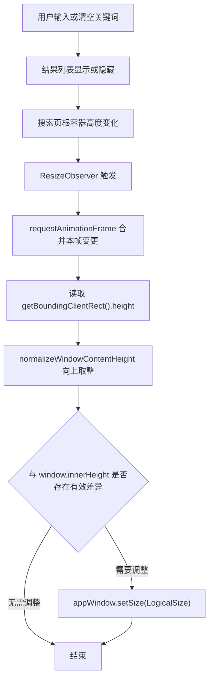
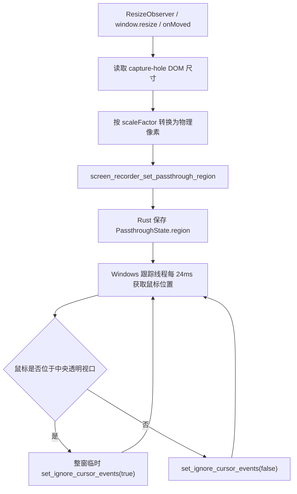

# 原生窗口贴合与区域穿透设计说明

## 1. 文档目的

本文说明两类容易混淆的透明窗口交互方案：

1. 快速搜索窗口：使用“原生窗口贴合可见内容”，消除无意义的透明占位区。
2. 区域录制窗口：保留中央透明录制视口，使用“区域级鼠标穿透”。

两类窗口的视觉效果相似，但需求不同。快速搜索不应恢复鼠标位置轮询；区域录制也不能简单套用搜索窗口的自动收缩方案。

## 2. 核心判断原则

先回答一个问题：透明区域是否属于功能本体？

| 场景 | 透明区域用途 | 推荐方案 |
| --- | --- | --- |
| 快速搜索默认态 | 结果列表尚未出现时遗留的占位区，没有交互价值 | 收缩真实原生窗口 |
| 快速搜索结果态 | 列表可见，需要正常接收鼠标事件 | 展开真实原生窗口 |
| 区域录制窗口 | 中央区域用于预览被录制内容，并允许操作下层应用 | 保留窗口外框，仅让中央视口穿透 |
| 录制窗口标题栏、边框、控制条 | 用于拖拽、调整大小和控制录制 | 必须继续接收鼠标事件 |

原则很简单：

- 无意义透明区域：从原生窗口尺寸中移除。
- 有意义透明区域：保留原生窗口，并精确控制穿透范围。

## 3. 快速搜索：原生窗口贴合可见内容

### 3.1 目标

快速搜索窗口默认只显示输入框。出现结果时，窗口向下展开；清空搜索或关闭结果时，窗口重新收缩。

这里调整的是 Tauri 原生 Webview 窗口的真实高度，不只是修改页面 CSS 高度。因此收缩后的区域不再属于应用窗口，鼠标会自然落到桌面或下层应用，不需要额外穿透逻辑。

### 3.2 入口文件

- 页面入口：`src/pages/search/index.vue`
- 自动贴合 Hook：`src/hooks/useFitWindowToElement.ts`
- 纯函数与防抖阈值：`src/hooks/windowContentSizing.ts`
- 单元测试：`src/hooks/windowContentSizing.test.ts`
- 默认窗口尺寸：`src-tauri/tauri.conf.json`

页面将根容器交给 Hook：

```ts
const searchRef = ref<HTMLElement | null>(null);

useFitWindowToElement(searchRef);
```

```vue
<main ref="searchRef" data-tauri-drag-region class="main">
  <!-- 输入框 -->
  <!-- 检索结果 -->
</main>
```

结果组件没有结果时使用 `display: none`：

```vue
<Result
  :class="{ hidden: !hasResults }"
/>
```

```scss
:deep(.hidden) {
  display: none;
}
```

所以根容器高度会真实改变，`ResizeObserver` 能观察到变化。

### 3.3 运行链路



`useFitWindowToElement` 的关键逻辑：

```ts
desiredHeight = normalizeWindowContentHeight(
  element.getBoundingClientRect().height
);

await appWindow.setSize(
  new LogicalSize(Math.max(1, window.innerWidth), targetHeight)
);
```

宽度沿用当前 `window.innerWidth`，只修改高度。这样不会破坏窗口居中后的横向布局。

### 3.4 为什么需要三层稳定机制

#### 使用 `ResizeObserver`

列表高度是动态的。结果数量、标签切换、样式变化、字体渲染都可能改变容器尺寸。监听 DOM 实际尺寸比在业务事件中手动计算高度更可靠。

#### 使用 `requestAnimationFrame`

一次搜索更新可能引起多次布局变化。每帧只测量一次，避免连续读取布局并调用原生 IPC。

```ts
if (animationFrameId !== null) return;
animationFrameId = window.requestAnimationFrame(measureAndResize);
```

#### 使用串行写入与“最后目标高度”

`setSize()` 是异步调用。如果布局在调用期间继续变化，Hook 不会并发发送多个尺寸请求，而是保留最新的 `desiredHeight`，等待当前调整结束后继续处理。

```ts
while (desiredHeight !== null) {
  const targetHeight = desiredHeight;
  desiredHeight = null;
  await appWindow.setSize(...);
}
```

这相当于只保证最终尺寸正确，不要求每个中间尺寸都落到原生窗口。

### 3.5 高度归一化与抖动处理

`windowContentSizing.ts` 使用两个规则：

```ts
export function normalizeWindowContentHeight(contentHeight: number): number {
  if (!Number.isFinite(contentHeight)) {
    return 1;
  }

  return Math.max(1, Math.ceil(contentHeight));
}
```

- 高度向上取整，避免底部边框被裁掉。
- 异常值或折叠值至少保留 `1px`，避免向原生 API 提交无效尺寸。

```ts
return (
  targetHeight > currentHeight ||
  currentHeight - targetHeight > WINDOW_HEIGHT_TOLERANCE
);
```

- 展开立即执行，避免列表被截断。
- 收缩时忽略 `1px` 差异，避免字体渲染或边框取整造成窗口来回跳动。

### 3.6 默认高度

`src-tauri/tauri.conf.json` 中主窗口初始高度为 `58`：

```json
{
  "label": "main",
  "width": 700,
  "height": 58,
  "resizable": false,
  "transparent": true
}
```

这确保首次打开时只有搜索输入区域。后续展开由前端调用 Tauri Window API 完成。

### 3.7 为什么不再使用鼠标穿透

旧思路通常会保留一个较高透明窗口，再根据鼠标位置决定是否调用 `set_ignore_cursor_events`。这种方案会引入：

- 前端 `mousemove` 或后端轮询；
- CSS 坐标、逻辑像素和物理像素换算；
- 固定偏移量；
- 窗口整体穿透后输入框暂时无法点击；
- 鼠标位于边界时频繁切换状态；
- IPC 和时序竞争。

快速搜索没有必要承担这些复杂度。透明占位区消失后，操作系统自然完成命中测试。

项目约束已经写入 `docs/ARCHITECTURE.md`：不要为快速搜索恢复整窗 `set_ignore_cursor_events`、前端 `mousemove` IPC、固定坐标偏移或后端鼠标轮询。

## 4. 区域录制：保留中央透明视口并穿透

### 4.1 结论

区域录制窗口不是快速搜索方案的复用。

它必须保留一个完整的外层窗口：

- 顶部标题栏用于拖动窗口；
- 四周边缘用于调整录制区域大小；
- 底部控制条用于开始、暂停、停止和导出；
- 中央 `capture-hole` 用于显示并操作下层应用。

因此录制窗口采用区域穿透，而不是收缩窗口。

### 4.2 入口文件

- 录制页面：`src/plugins/screen-recorder/pages/recorder/index.vue`
- 前端 IPC 封装：`src/plugins/screen-recorder/pages/recorder/core/recordingApi.ts`
- Rust 后端：`src-tauri/src/plugins/screen_recorder.rs`
- 命令注册：`src-tauri/src/lib.rs`

页面结构：

```vue
<header class="title-bar">...</header>

<main class="capture-viewport">
  <div class="capture-frame">
    <div ref="captureHoleRef" class="capture-hole"></div>
  </div>
</main>

<footer class="control-strip">...</footer>
```

### 4.3 前端如何计算穿透区域

前端读取 `capture-hole` 的 DOM 边界，并转换为窗口内部的物理像素区域：

```ts
const rect = hole.getBoundingClientRect();
const scale = await appWindow.scaleFactor();
const innerPosition = await appWindow.innerPosition();

const region = {
  x: rect.left,
  y: rect.top,
  screenX: Math.round(innerPosition.x + rect.left * scale),
  screenY: Math.round(innerPosition.y + rect.top * scale),
  physicalWidth: Math.round(rect.width * scale),
  physicalHeight: Math.round(rect.height * scale),
  scale
};
```

普通模式下，将中央视口完整发送给后端：

```ts
await setRecorderPassthroughRegion({
  x: Math.round(region.x * region.scale),
  y: Math.round(region.y * region.scale),
  width: region.physicalWidth,
  height: region.physicalHeight
});
```

窗口移动、窗口缩放、DOM 布局变化都会重新测量：

- `ResizeObserver` 监听 `capture-hole`；
- `appWindow.onMoved()` 监听原生窗口移动；
- `window.resize` 监听尺寸变化；
- `requestAnimationFrame` 合并同一帧的刷新。

前端还会用约 `2px` 容差比较新旧区域，避免没有意义的 IPC。

### 4.4 Rust 后端如何实现区域穿透

Tauri 提供的 `set_ignore_cursor_events(true)` 是整窗穿透，不支持只穿透中央矩形。因此后端保存中央矩形，并在 Windows 上启动一个轻量跟踪线程：

```rust
struct PassthroughState {
    region: Option<PassthroughRegion>,
    running: bool,
    last_ignored: bool,
}
```

跟踪线程每 `24ms` 获取一次全局鼠标坐标：

```rust
let mut point = POINT::default();
GetCursorPos(&mut point)?;

let x = point.x - inner_position.x;
let y = point.y - inner_position.y;

let should_ignore =
    x >= region.x &&
    y >= region.y &&
    x < region.x + region.width &&
    y < region.y + region.height;
```

只有状态变化时才调用：

```rust
window.set_ignore_cursor_events(should_ignore);
```

效果如下：

| 鼠标位置 | 原生窗口状态 | 结果 |
| --- | --- | --- |
| 中央录制视口 | `set_ignore_cursor_events(true)` | 鼠标交给下层应用 |
| 标题栏、边框、控制条 | `set_ignore_cursor_events(false)` | 录制窗口正常交互 |

这类轮询只适用于录制窗口，因为中央透明区域必须长期存在。

### 4.5 全屏贴合时的窗口区域裁剪

录制框贴合到全屏或显示器边缘时，除了鼠标穿透，还会调用：

```ts
setRecorderOverlayWindowRegion({
  width,
  height,
  topHeight,
  bottomHeight
});
```

Windows 后端使用 `SetWindowRgn`，只保留顶部标题栏和底部控制条：

```rust
let combined = CreateRectRgn(0, 0, width, top_height.max(1));
let bottom = CreateRectRgn(0, height - bottom_height, width, height);
CombineRgn(Some(combined), Some(combined), Some(bottom), RGN_OR);
SetWindowRgn(hwnd, Some(combined), true);
```

中央区域从原生窗口命中区域中移除。这样在全屏贴合场景下，下层应用交互更稳定。

### 4.6 排除录制控制层自身

录制窗口打开后还会调用：

```ts
setRecorderCaptureExcluded(true);
```

Windows 后端使用：

```rust
SetWindowDisplayAffinity(hwnd, WDA_EXCLUDEFROMCAPTURE)
```

它的作用是防止标题栏、边框和控制条被系统录制进去。这与鼠标穿透是两件独立的事情：

- `set_ignore_cursor_events`：决定鼠标事件落到哪个窗口。
- `SetWindowRgn`：裁剪原生窗口的有效区域。
- `SetWindowDisplayAffinity`：决定录制时是否捕获控制层窗口。

### 4.7 录制窗口链路



## 5. 两套方案对比

| 维度 | 快速搜索 | 区域录制 |
| --- | --- | --- |
| 透明区域是否必要 | 否 | 是 |
| 是否修改真实窗口尺寸 | 是 | 用户缩放或贴合时修改 |
| 是否使用 `ResizeObserver` | 是，测量整个内容根节点 | 是，测量中央录制视口 |
| 是否使用 `setSize` | 是，自动贴合内容高度 | 是，用于录制框缩放和窗口贴合 |
| 是否使用鼠标位置轮询 | 否 | Windows 下是，每 `24ms` |
| 是否调用 `set_ignore_cursor_events` | 不应调用 | 中央视口区域需要 |
| 是否调用 `SetWindowRgn` | 否 | 全屏贴合时使用 |
| 是否排除自身录制 | 不涉及 | 使用 `WDA_EXCLUDEFROMCAPTURE` |

## 6. 新增类似窗口时如何选型

### 6.1 使用“内容贴合窗口”

适用于弹窗、提示框、快速搜索、浮动工具条等内容高度会变化，但透明空白没有交互意义的窗口。

步骤：

1. 让页面根容器高度由真实可见内容决定。
2. 对根容器创建 `ref<HTMLElement | null>`。
3. 调用 `useFitWindowToElement(rootRef)`。
4. 确保 Tauri capability 包含 `core:window:allow-set-size`。
5. 将初始窗口高度设置为默认最小可见内容高度。
6. 为高度归一化和抖动容差增加单元测试。

### 6.2 使用“区域穿透窗口”

仅适用于透明区域本身有明确功能，且窗口其他区域仍需交互的场景，例如录制框。

步骤：

1. 明确定义可穿透 DOM 区域。
2. 统一使用物理像素与窗口内部坐标传给后端。
3. 监听窗口移动、缩放和 DOM 变化。
4. 对区域变化做容差比较，减少 IPC。
5. 后端只在穿透状态变化时调用 `set_ignore_cursor_events`。
6. 关闭窗口、异常退出、组件卸载时强制恢复 `false`。
7. Windows 全屏覆盖场景优先考虑 `SetWindowRgn`。

## 7. 排查指南

### 7.1 快速搜索出现透明空白

依次检查：

1. `Result` 隐藏时是否真实使用 `display: none`。
2. `searchRef` 是否绑定到包含输入框和结果列表的根容器。
3. `ResizeObserver` 是否已经在 `onMounted` 后观察该节点。
4. capability 是否包含 `core:window:allow-set-size`。
5. `setSize()` 是否抛出错误，查看 `fitWindowToSearchContent` 日志。
6. 是否错误地给根容器设置了固定高度或 `min-height`。

### 7.2 快速搜索窗口上下抖动

依次检查：

1. 是否绕过了 `windowContentSizing.ts` 的容差逻辑。
2. 是否在多个地方同时调用 `setSize()`。
3. 是否有边框、滚动条或字体导致 `1px` 来回变化。
4. 是否误用 `Math.floor()`，导致底部内容偶发裁剪。

### 7.3 录制中央区域无法点击下层应用

依次检查：

1. `capture-hole` 是否存在并具有正确尺寸。
2. 前端是否调用 `screen_recorder_set_passthrough_region`。
3. 后端 `PASSTHROUGH_STATE.region` 是否为非空正尺寸区域。
4. 鼠标坐标是否正确减去了 `window.inner_position()`。
5. 高 DPI 环境下是否遗漏 `scaleFactor()` 换算。
6. 关闭窗口或重新贴合后，旧区域是否正确清理。

### 7.4 录制控制条无法点击

依次检查：

1. 穿透区域是否错误覆盖了底部控制条。
2. 全屏模式下是否正确扣除了标题栏和控制条高度。
3. `SetWindowRgn` 的顶部和底部区域是否计算正确。
4. 关闭或切换模式时是否恢复了 `set_ignore_cursor_events(false)`。

## 8. 维护约束

1. 快速搜索禁止恢复整窗穿透轮询。
2. 区域录制的轮询必须限制在窗口存在且穿透区域非空时运行。
3. 所有原生窗口尺寸调整都应避免并发写入和无效重复 IPC。
4. 所有 DPI 相关区域计算都必须明确区分逻辑像素与物理像素。
5. 所有穿透方案都必须有关闭窗口时恢复鼠标事件的兜底逻辑。

